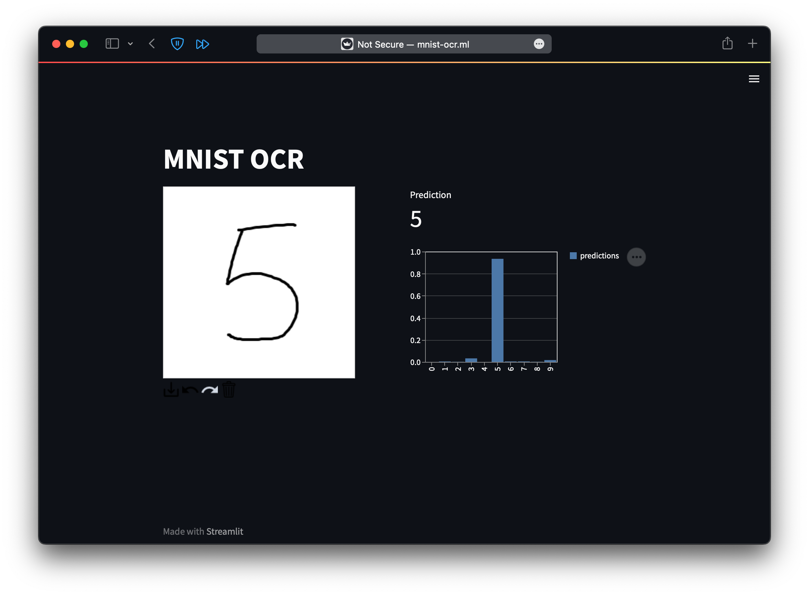

# mnist-ocr

Recognize handwritten digits



## Tools Used

This project demonstrates the use of various MLOps tools and techniques:

- [cookiecutter data science project template](https://drivendata.github.io/cookiecutter-data-science/)
- Tensorflow
- GitHub Actions
- DVC
- CML
- Streamlit for Web UI
<!-- - DagsHub -->
<!-- - MLFlow for tracking model parameters, metrics and model registry -->

## Manual deployment on Azure

```bash
# add deploy key if repo is private
sudo apt install python3-pip
sudo pip install poetry
git clone git@github.com:blesswinsamuel/mnist-ocr.git
cd mnist-ocr
poetry install
# configure dvc remote credentials
sudo -E poetry run streamlit run src/visualization/visualize.py --server.port 80 # in tmux
```
